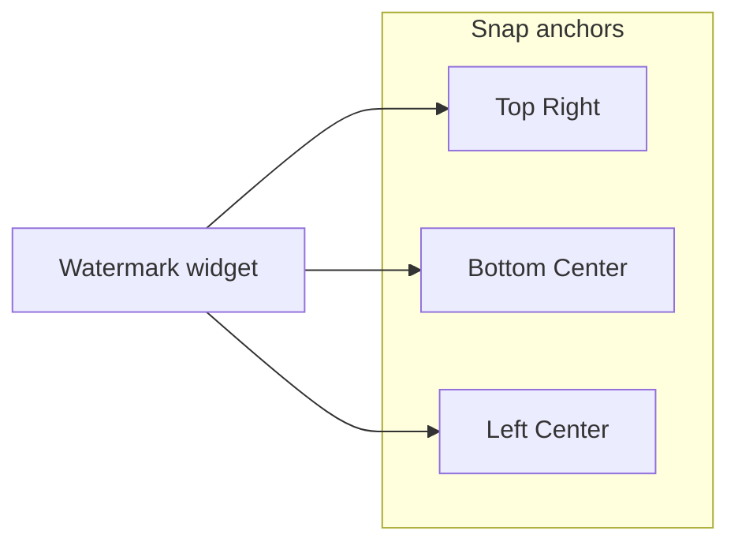

# Shinymoon Watermark Widget — Visual Design

Estilo alvo: **Neverlose CS2 overlay** — pill escuro, tipografia compacta, accent único, stats tabulares, separadores discretos.

## Referências (web)

| Fonte | Padrão visual |
|-------|----------------|
| [Neverlose UI docs](https://docs-csgo.neverlose.cc/useful-information/script-examples/ui) | `render.gradient` + `render.rect` para pills e accent bars |
| [YouGame watermark thread](https://yougame.biz/threads/235346/) | Top-right bar, segmentos `{cheat, name, ping, fps, tick, time}`, rainbow line |
| Scripts HVH (godsense, LuaSense) | Bottom-center default, drag + snap, gradient/rainbow text |
| Shinymoon atual | Texto simples bottom-center, accent + gradient opcional |

## Tokens (shinymoon × NL)

| Token | Hex | Uso |
|-------|-----|-----|
| `--bg-pill` | `#15151C` @ 88% | Fundo do widget |
| `--border` | `#2C2C35` | Hairline externa |
| `--text-primary` | `#F5F5F7` | Nome / brand |
| `--text-muted` | `#A1A1AA` | Stats (ping, fps, tick) |
| `--accent` | `#4A9EFF` | Barra, brand highlight, dot ativo |
| `--accent-2` | `#BF5AF2` | Gradiente secundário |
| `--shadow` | `#000000` @ 45% | Drop shadow sob pill |

## Anatomia base

```
┌──────────────────────────────────────────────┐  ← accent bar 2px (gradient L→R)
│  shinymoon.lua  ·  yeet233  ·  42ms  ·  240fps │
└──────────────────────────────────────────────┘
   ↑ brand (accent/gradient)    ↑ muted stats (mono, tabular-nums)
```

Padding: **10×14px** (vertical × horizontal). Radius: **6px** (NL clássico) ou **999px** (chip). Font: Default/Small para HUD; Console para stats.

## Variantes propostas

| ID | Nome | Posição default | Diferencial |
|----|------|-----------------|-------------|
| A | **NL Classic Pill** | Top-right | Barra accent no topo + fundo escuro |
| B | **Glass Strip** | Top-right | Borda fina + blur simulado, sem barra |
| C | **Accent Rail** | Bottom-center | Barra vertical 3px à esquerda |
| D | **Minimal Text** | Bottom-center | Só texto (atual shinymoon, refinado) |
| E | **Stat Chips** | Top-right | Segmentos em cápsulas separadas |
| F | **Brand + HUD Row** | Bottom-center | Brand grande + linha de stats abaixo |

## Posicionamento



Margem segura: **8px** da borda da tela. Bottom-center: `y = screen.h - text.h - 8`.

## Mapeamento render (Neverlose)

Pseudo-Lua comum a todas as variantes com pill:

```lua
-- medidas
local pad_x, pad_y = 14, 10
local radius = 6
local size = render.measure_text(font, nil, text)
local w, h = size.x + pad_x * 2, size.y + pad_y * 2
local tl = vector(pos.x - w * 0.5, pos.y - h * 0.5)
local br = vector(pos.x + w * 0.5, pos.y + h * 0.5)

-- shadow
render.rect(tl + vector(0, 2), br + vector(0, 2), color(0, 0, 0, 115), radius)

-- pill
render.rect(tl, br, color(21, 21, 28, 225), radius)

-- accent top bar (variant A)
render.gradient(
  vector(tl.x, tl.y), vector(br.x, tl.y + 2),
  accent, accent2, accent, accent2
)

-- text centered
render.text(font, vector(pos.x, pos.y), accent, "c", label)
```

## Menu (futuro — não implementado aqui)

- Style: Classic | Glass | Rail | Minimal | Chips | Split
- Position: Bottom Center | Top Right | Custom (drag)
- Segments: toggles para build / ping / fps / tick / time
- Accent + Secondary (já existem no menu atual)

## Protótipo

Abrir `.cursor/design/shinymoon-watermark/index.html` no browser — mockup CS2 + seletor de variantes + animação de gradiente.
