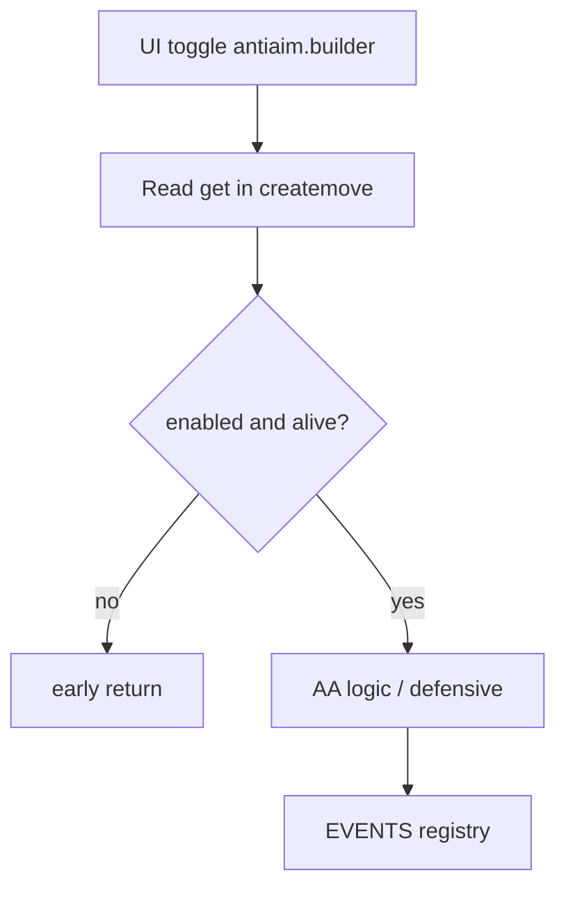

# Shinymoon Plan

Plan-first workflow for `shinymoon_alpha.lua`. **No implementation** until the user approves.

## When to use

- New HVH feature (anti-aim, defensive, visuals, misc)
- Refactor touching multiple buckets (UI, AA, VIS, EVENTS)
- User asks for plan, spec, diagram, or "passo a passo"
- Before `/opsx-propose` when requirements are still fuzzy → explore first

## When NOT to use

- Single-line fix, typo, one guard (use ponytail + direct edit)
- User said "just fix it" or "skip plan"

## Workflow

```
explore → propose → [user approves] → apply (one task group) → review → archive
```

### 1. Explore (optional)

- graphify: `graphify query "<feature area>"` or open `graphify-out/graph.html`
- MCP `shinymoon-alpha-tools`: NL docs lookup, Lua search
- Summarize current behavior with file section references

### 2. Propose artifacts

Create or update `openspec/changes/<kebab-name>/`:

| File | Content |
|------|---------|
| `proposal.md` | Why, scope, rollback, test scenario |
| `specs/*/spec.md` | Delta ADDED/MODIFIED/REMOVED |
| `design.md` | Sections, callbacks, **Mermaid diagram** |
| `tasks.md` | Checkbox groups (15–40 min each) |

Follow rules in `openspec/config.yaml`.

### 3. Visual review (when helpful)

| Need | Tool |
|------|------|
| Menu layout mockup | open-design MCP + `shinymoon-apple-ui` |
| Architecture graph | `graphify-out/graph.html` |
| Flow in chat | Mermaid in `design.md` |
| Interactive checklist | Ask user for Canvas with phases/todos (Cursor built-in) |

Save Plan Mode output to `.cursor/plans/<kebab-name>.md` when using Plan Mode alongside OpenSpec.

### 4. Gate

Stop and ask: **"Approve plan to implement?"**

Only after explicit approval → `/opsx-apply <name>` or user request to implement one task group.

## Mermaid template (design.md)



## Domain map (quick reference)

| Domain | Lua buckets | Spec |
|--------|-------------|------|
| Core | NL, CORE, EVENTS, CFG | `openspec/specs/core/spec.md` |
| Anti-aim | AA, builder, defensive | `openspec/specs/antiaim/spec.md` |
| UI | UI, NAV, home, antiaim_tab | `openspec/specs/ui/spec.md` |
| Visuals | VIS | `openspec/specs/visuals/spec.md` |

## Handoff skills

- Implementation: `shinymoon-lua-workflow`
- Menu polish: `shinymoon-apple-ui`
- Final check: `shinymoon-review`
