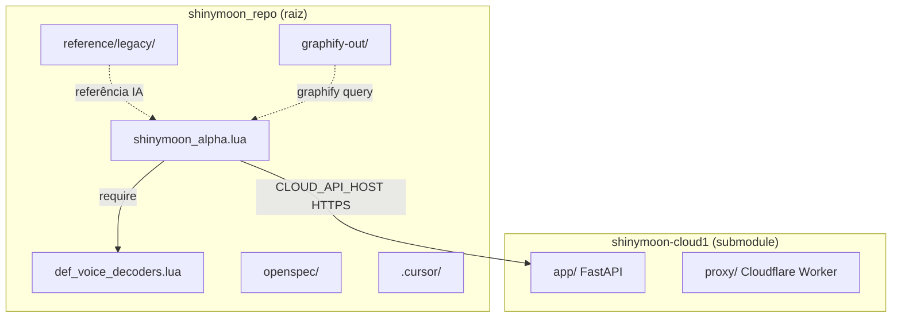

# Mapa do repositório Shinymoon

Última revisão: 2026-06-26

## Visão geral

Monorepo local com **dois repositórios Git**:



| Repo | URL | Branch default remoto |
|------|-----|------------------------|
| Script + tooling | `https://github.com/dfs736037-star/shinymoon_repo.git` | `cursor/plan-first-openspec-setup` |
| Cloud API | `https://github.com/dfs736037-star/shinymoon-cloud1.git` | `master` (local: `07e976c`) |

---

## Raiz — runtime Neverlose

Estes arquivos **devem ficar na raiz** de `nl/scripts/shinymoon_1/`:

| Arquivo | ~KB | Função |
|---------|-----|--------|
| `shinymoon_alpha.lua` | 326 | Script principal (~10k linhas, buckets NL/CORE/UI/AA/VIS/MISC/EVENTS/CFG) |
| `def_voice_decoders.lua` | 13 | `require("def_voice_decoders")` — decoders de voz para defensive |
| `shinymoon_icon.png` | 26 | Ícone do menu |

---

## `reference/` — só leitura

Scripts HVH de outros autores usados como **referência para portar padrões** para `shinymoon_alpha.lua`. Não carregar no Neverlose; não editar salvo pedido explícito.

| Arquivo | Origem / notas |
|---------|----------------|
| `legacy/Frost1_8.lua` | Frost — DTC, builder grande |
| `legacy/LuaSenseB_17.lua` | LuaSense — hidden AA, defensive |
| `legacy/Nyanza Snapshot_162_23.lua` | Nyanza snapshot |
| `legacy/arc_16.lua` | Arc |
| `legacy/gazolina_6.lua` | Gazolina |
| `legacy/gingersenseB_4.lua` | Gingersense — pós-defensive |
| `legacy/godsense_11.lua` | Godsense |
| `legacy/grenade_8.lua` | Grenade helpers |
| `legacy/unmatchedB_5.lua` | Unmatched |
| `legacy/world_15.lua` | World visuals |
| `legacy/xo-yaw_25.lua` | XO-Yaw builder |
| `iapeek_base` | Snippet ia-peek (sem extensão) |

**Total referência:** ~4,2 MB de Lua legado.

---

## `docs/`

| Arquivo | Conteúdo |
|---------|----------|
| `csgo_netvars_flags_referencia.md` | Flags de netvars CS:GO |
| `shinymoon_records.md` | Telemetria DTC / defensive histórica |

---

## `openspec/`

| Caminho | Propósito |
|---------|-----------|
| `specs/antiaim/spec.md` | Comportamento AA canônico |
| `specs/core/spec.md` | Presets, CFG, core |
| `specs/ui/spec.md` | Menu / PUI |
| `specs/visuals/spec.md` | VIS bucket |
| `changes/dtc-reliability/` | **Ativo** — overhaul DTC send-tick |
| `changes/dtc-hidden-aa/` | **REVERTED** — registro histórico |
| `changes/archive/` | Changes arquivados |
| `config.yaml` | Schema spec-driven + regras para IA |

---

## `graphify-out/`

Knowledge graph do código Lua (686 nós, 75 comunidades).

| Artefato | Commitar? |
|----------|-----------|
| `graph.json`, `graph.html`, `GRAPH_REPORT.md`, `manifest.json` | Sim (útil offline) |
| `cache/` | **Não** — `.gitignore` |

God nodes (mais conectados): helpers internos de `Frost1_8` / `arc_16` + `AGENTS.md`.

---

## `shinymoon-cloud/` (submodule)

API REST para biblioteca de configs na nuvem.

```
shinymoon-cloud/
├── app/           # FastAPI + SQLite
├── proxy/         # Worker Cloudflare (Neverlose não aceita *.up.railway.app)
├── requirements.txt
├── railway.toml
└── README.md      # Deploy Railway + domínio custom
```

Variáveis críticas: `SHINymoon_API_SECRET`, `DATABASE_URL`, volume `/data`.

---

## `.cursor/` — tooling IA

| Pasta | Conteúdo |
|-------|----------|
| `rules/` | ponytail, plan-first, graphify, neverlose-api |
| `skills/` | shinymoon-*, graphify, open-design, browser-harness |
| `commands/` | `/code`, `/opsx-*` |
| `agents/` | shinymoon-code subagent |
| `mcps/` | shinymoon_alpha_tools, graphify, open-design |
| `setup/` | planning, ollama |
| `design/shinymoon-watermark/` | mockup watermark |

---

## Estado Git (2026-06-26)

- **Local:** branch `master`, commit `1f3a1ae` — praticamente vazio.
- **Staging:** ~150 arquivos adicionados, **não commitados**.
- **Untracked:** changes OpenSpec `dtc-*`, cache graphify novo, setup ollama.
- **Submodule:** `shinymoon-cloud` nested com `.git` próprio; `.gitmodules` adicionado nesta organização.

### Próximo passo Git recomendado

1. Revisar `git status`.
2. Commit único: "Add shinymoon_alpha, tooling, openspec, and reference layout".
3. Push para `cursor/plan-first-openspec-setup` ou merge `master` → default.

---

## Regras para agentes

Ver `AGENTS.md`. Resumo:

- Editar só `shinymoon_alpha.lua` por padrão.
- Plan-first se 3+ seções ou arquitetura AA/defensive.
- `graphify update .` após edits Lua.
- Legacy em `reference/legacy/` — read-only.
