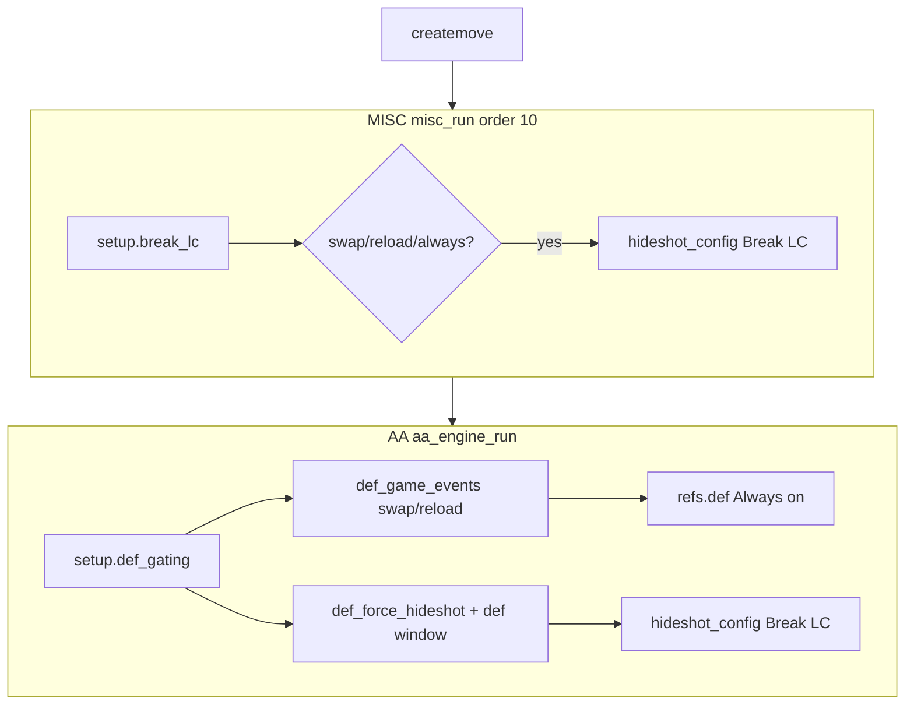
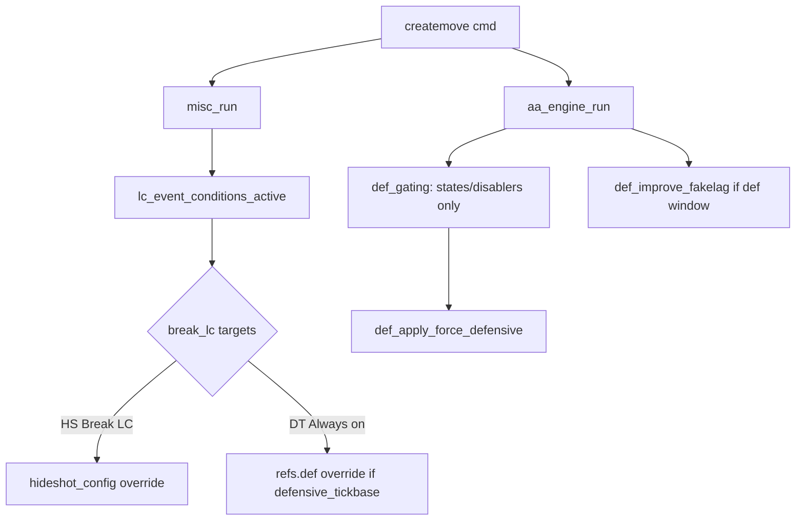

# Design: Consolidate LC + Defensive Gating

## Problem (today)

Duplicate condition checks; `HS2` can override `HS1` same tick.

## Target architecture

## Buckets and symbols

| Bucket | Symbols | Change |
|--------|---------|--------|
| UI.setup | `setup.break_lc`, `setup.break_lc_conditions`, **new** `setup.break_lc_targets` | Add targets listable; optional rename label |
| UI.setup | `setup.def_gating`, `setup.def_conditions`, `setup.def_disablers`, `setup.def_improve_fakelag` | Remove `def_game_events`, `def_force_hideshot` |
| CORE | `lc_event_conditions_active(me)` | New shared helper |
| CORE | `weapon_is_reloading(weapon)` | Merge duplicate reload checks |
| MISC | `misc_on_break_lc(me)` | Call shared helper; apply HS + DT lag targets |
| AA | `apply_defensive_runtime_overrides` | Only improve fakelag (+ clear HS/DT if moved) |
| AA | remove `def_update_game_event_boost` weapon tracking | Weapon class latch moves to shared helper or misc only |

## Callback order (unchanged)

1. `EVENTS` createmove → `aa_cm_handler`
2. `misc_run(cmd)` — **LC overrides applied here**
3. `aa_engine_run()` — DTC + def fakelag + gating guards
4. `def_apply_force_defensive(last_cmd, ...)`

Authority rule: **Break LC panel owns all LC-event-driven ref overrides**; AA gating never writes `hideshot_config` or `refs.def` for swap/reload.

## UI mockup (text)

**Break LC** (expanded)
- Conditions: Weapon switch | Weapon reload | Always
- Don't override LC on Quickpeek (existing, Always only)
- **Targets:** Hide Shots Break LC | DT Lag Always on

**Defensive Gating** (slimmed)
- Active States
- Disablers
- Improve Fakelag on Defensive

open-design prototype: optional if label rename to "LC Control" — layout is a listable + listable, low risk without mockup.

## Config migration

Presets / saved UI: no stable public config API — on load, users re-select targets once. Document in tasks: if cloud preset JSON keys exist for `def_game_events`, map to `break_lc_targets` in a one-time compatibility shim (only if preset layer references those keys).
