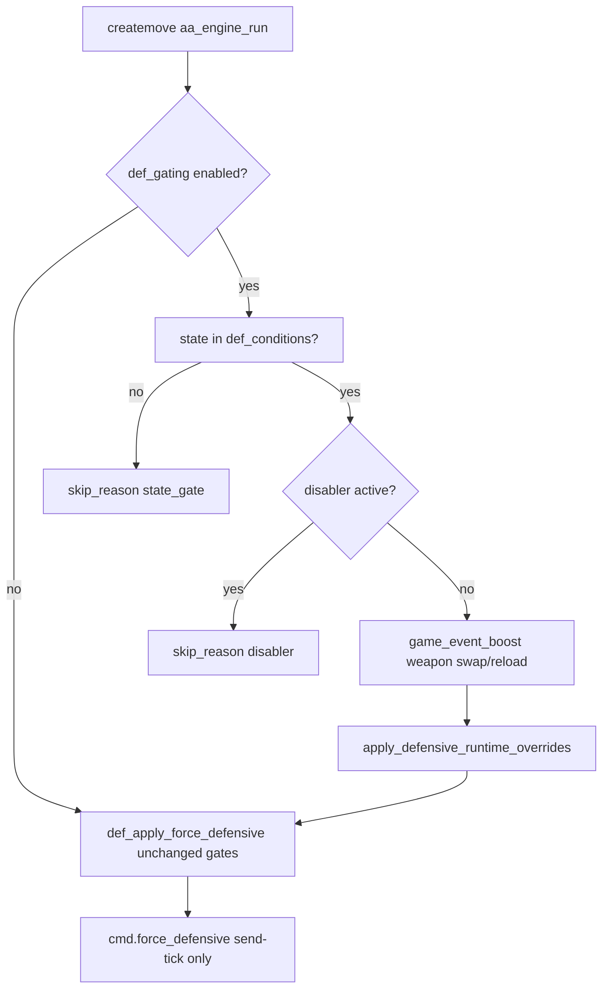

# Design: Defensive Gating

## Flow

## Integration points

| Hook | File region | Behavior |
|------|-------------|----------|
| `def_state_allowed` | before `def_should_fire` | Blocks DTC when state not in filter |
| `def_disabler_blocks` | `aa_engine.def.gating_blocked` | Blocks DTC when FS/manual/peek active |
| `def_update_game_event_boost` | end of `aa_engine_run` | Sets `refs.def` Always on on swap/reload |
| `apply_defensive_runtime_overrides` | end of `aa_engine_run` | FL=1, HS Break LC during def window |

Per-state `defensive_tickbase` remains required; gating adds global filters only.
