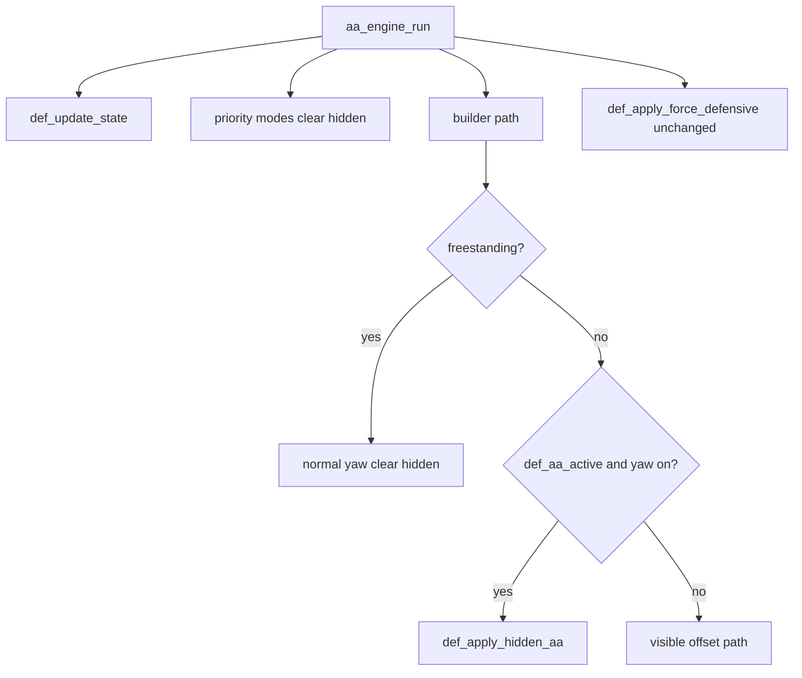

# Design: DTC Hidden AA Mirror

## Flow

## Mirror mapping

Reuse `apply_yaw_and_desync` + `apply_modifier` → hidden yaw. Pitch fixed 89. Body limits unchanged.

## Files

- [`shinymoon_alpha.lua`](shinymoon_alpha.lua): helpers ~L5260, wire ~L5811, debug ~L6124
