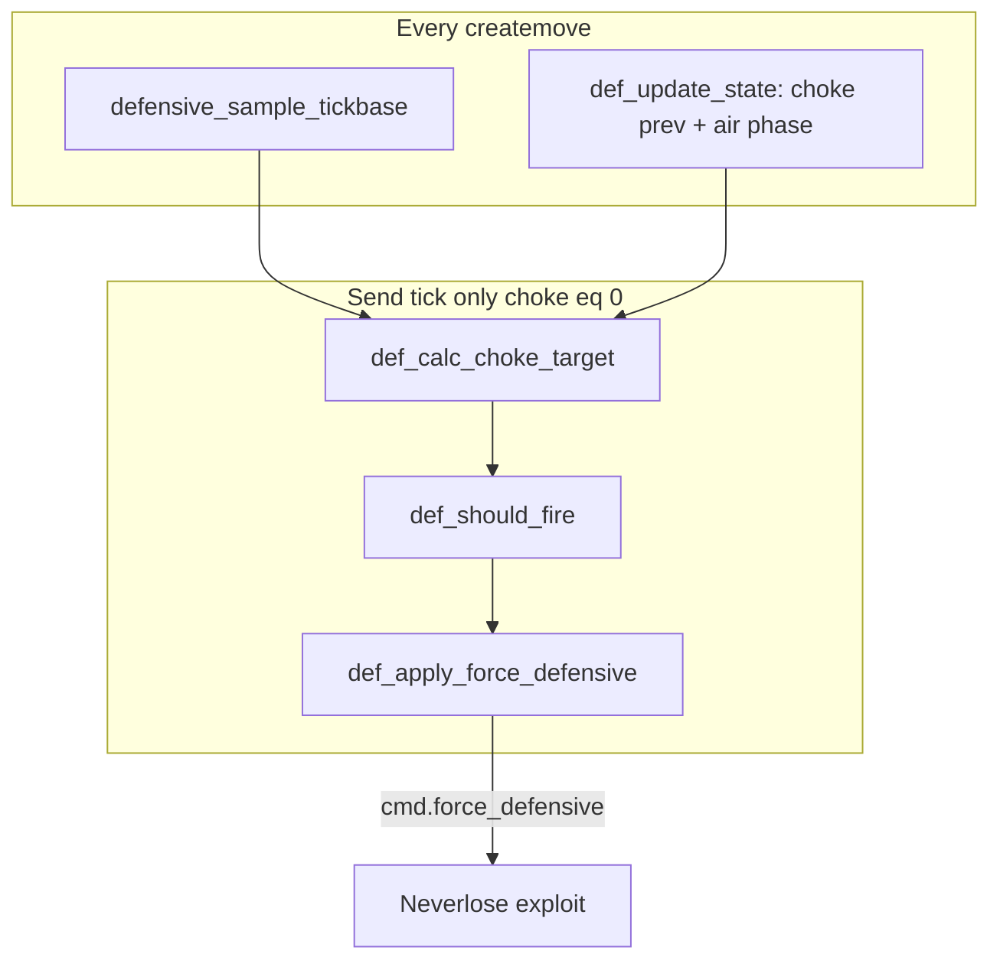

# Design: DTC Reliability Overhaul

## Sections touched

| Section | Functions |
|---------|-----------|
| AA.def | `defensive_sample_tickbase`, `def_update_state`, `def_calc_choke_target`, `def_should_fire`, `def_apply_force_defensive` |
| AA.events | `aa_engine_run` (config passed to DTC apply) |
| AA debug | `render` AA debug panel + DTC log helper |

## Flow

## Fire contract

1. `def_at_send_tick()` → `choked_commands == 0`; all fire paths require this.
2. Pre-window: fire at `at_fire_point` (`prev_choke >= fire_choke`).
3. In-window: fire once on `window_start` when `window_fire_armed` and `at_fire_point`; subsequent fires at `at_fire_point` as consumed ticks advance.
4. `def_apply_force_defensive` reads `config` from `resolve_state_config`, not freestanding `commit_config`.

## Telemetry

`def_log_dtc` prints only when `setup.aa_debug` is on. Logs fire transitions and next-tick shift validation.
