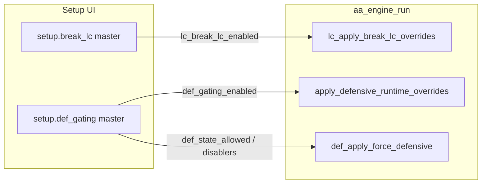
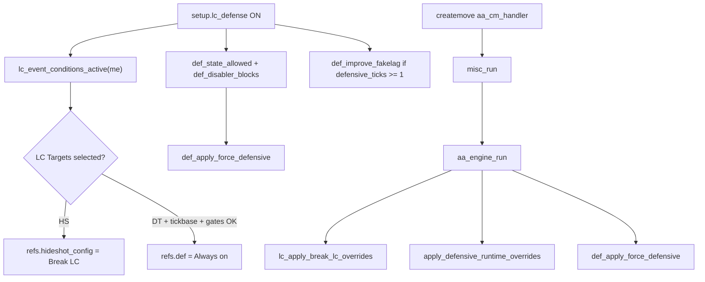

# Design: Unify LC & Defensive UI

## Problem (today)



Two masters; users must know to enable both for full LuaSense-style defensive setup.

## Target architecture



**Authority rule (unchanged from consolidate):** LC-event ref overrides only in `lc_apply_break_lc_overrides`; DTC only in `def_apply_force_defensive`; improve fakelag only in `apply_defensive_runtime_overrides`.

## Buckets and symbols

| Bucket | Location in `shinymoon_alpha.lua` | Change |
|--------|----------------------------------|--------|
| UI.setup | ~560–655 | Replace two switches with `setup.lc_defense`; single `lc_def_grp`; merge visibility |
| UI.cfg | `cfg_refresh_ui` | Call `update_lc_defense_visibility` |
| AA.core | ~2692–2717 | `lc_defense_enabled()`; `lc_event_conditions_active` uses it |
| AA.def | ~5979–6091 | `def_state_allowed`, `def_disabler_blocks`, `apply_defensive_runtime_overrides` use `lc_defense_enabled` |
| AA.def | ~6058–6077 | `lc_apply_break_lc_overrides` uses `lc_defense_enabled`; fix empty targets |
| AA.engine | ~6640–6649 | call order unchanged |

## Helper contract

```lua
-- ponytail: one master replaces lc_break_lc_enabled + def_gating_enabled
local function lc_defense_enabled()
  return setup.lc_defense and setup.lc_defense:get()
end
```

When `lc_defense_enabled()` is **false**:

- `lc_event_conditions_active` → false
- `def_state_allowed` → true (no state gate)
- `def_disabler_blocks` → false
- `apply_defensive_runtime_overrides` → no-op

When **true**:

- Same behavior as **both** legacy masters ON today, except empty LC Targets apply no overrides.

## UI layout (text mockup)

**LC & Defensive** `[switch]` — icon `shield-halved` or `triangle-exclamation`

Child group (visible when master ON):

1. **LC Events** — listable: Weapon switch | Weapon reload | Always  
2. **LC Targets** — listable: Hide Shots Break LC | DT Lag Always on  
3. **Don't override LC on Quickpeek** — switch (visible if Always selected)  
4. **DTC Active States** — selectable (movement states)  
5. **DTC Disablers** — selectable: Freestanding | Manual AA | Peek Assist  
6. **Improve Fakelag on Defensive** — switch  

Section labels optional (`sub_label`) for "LC Events" vs "DTC Filters" — no second master switch.

## Callback order (unchanged)

1. `EVENTS.set_handler("createmove", "aa.cm", aa_cm_handler)`
2. `misc_run(cmd)`
3. `aa_engine_run()` — builder AA, then end-of-tick:
   - `lc_apply_break_lc_overrides(me)`
   - `apply_defensive_runtime_overrides(config)`
   - `def_apply_force_defensive(last_cmd, tick, config)`

## Preset migration

`pui.save()` / `pui.load()` keys will change (control object identity). Shim in `CFG.import_snapshot` after `pui.load`:

- If loaded snapshot has no `lc_defense` but has legacy toggles in stored pui blob, rely on Neverlose restoring child values on new parent where IDs match; **document manual re-toggle once** if PUI paths diverge.
- ponytail: post-load hook — if `setup.lc_defense` exists and either legacy control reads true from orphaned state, set master ON once (only if implementable without fragile hacks; else document in tasks).

## open-design

Not required — vertical list of listables under one switch matches existing Setup patterns (`setup.safe_head`, `setup.anims`).
